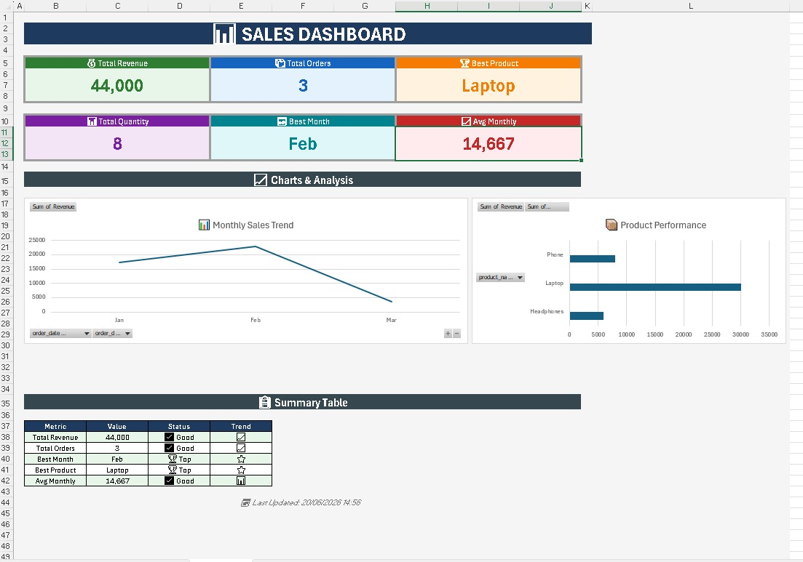

# Sales Performance & Analytics Dashboard

### 📊 Project Overview
An interactive and dynamic Sales Dashboard designed to track business revenue, product performance, and sales metrics. This project demonstrates an end-to-end data analysis workflow: leveraging **SQL Server** for backend database schema setup and advanced analysis, and **Advanced Excel** for dynamic data representation and visualization.

---

### 🖥️ Dashboard Preview

---

### 💡 Key Features & Analytical Insights
* **High-Level KPIs**: Dynamically tracks Total Revenue, Total Orders, Total Quantities, and Average Monthly Revenue[cite: 1].
* **Monthly Sales Trend**: Features a dynamic line chart visual highlighting peak performing months (e.g., February as the top-performing month).
* **Product Performance**: Ranks products using horizontal bar charts to discover best-selling items like the **Laptop**.
* **Summary & Status Tracking**: Built-in summary table leveraging custom logic icons to rank metrics as 'Good' or 'Top' indicators.

---

### 🛠️ Tech Stack & Methods Used
* **Advanced Excel**: Pivot Tables, Dynamic Charts, Pivot Slicers, Custom Number Formatting, and Conditional Formatting.
* **SQL Server (T-SQL)**: 
  * **DML/DDL**: Schema creation, table constraints, and data manipulation[cite: 1].
  * **Advanced Querying**: Joins (LEFT/CROSS), Set Operators (`UNION`, `INTERSECT`, `EXCEPT`), and Aggregations[cite: 1].
  * **Analytical SQL**: Built custom Window Functions (`SUM() OVER`, `DENSE_RANK() OVER`) and Common Table Expressions (CTEs) to calculate running totals and product ranks.

---

### 📁 Repository Structure
* `Sales.xlsx`: The main spreadsheet file containing raw data transformations and the interactive dashboard layout.
* `Sales_Analysis_Queries.sql`: The complete database script covering schema creation, record inserts, and analytical business queries[cite: 1].
* `image_a1d65e.png`: Screenshot of the finalized dashboard interface for instant profile preview.

---

### 👨‍💻 Author
**Mohamed Osama Hamedy**  
*Frontend Developer & Data Analyst specializing in modern interactive dashboards.*
